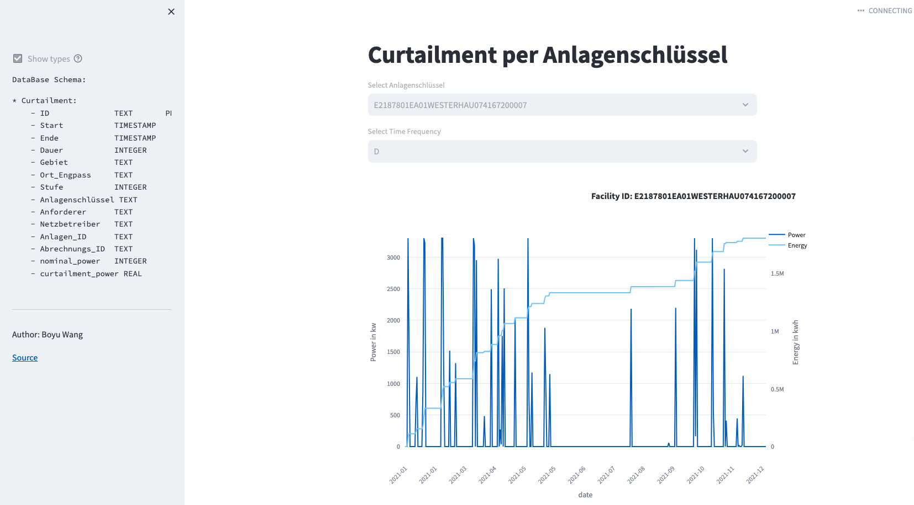

# Data Pipeline for Power Curtailment and EEG Analysis
## Description

This project implements a comprehensive data pipeline for analyzing power curtailment and EEG (Electrical Engineering Group) data. It utilizes Apache Airflow for orchestrating and scheduling ETL (Extract, Transform, Load) processes, integrates with a SQLite database for data storage, and employs Streamlit for interactive data visualization. The primary goal is to automate the extraction of daily and historical data, process this data for meaningful insights, and present it in an accessible manner through a web-based interface.

## Installation
Prerequisties: Python(3.8 or later)

```pip install apache-airflow streamlit pandas sqlalchemy```


## Usage
### Starting Airflow
Initialize and start the Airflow environment:

```airflow db init airflow webserver -p 8080 & airflow scheduler ```

Access the Airflow UI at http://localhost:8080 to manage and monitor your DAGs.
### Running ETL Processes
ETL processes are defined as DAGs in Airflow. You can trigger them manually from the Airflow UI or let them run on their defined schedules.

DAGs:

+ initial_bulk_data_download.py: Runs once to download and process historical data.
+ daily_data_download.py: Scheduled to run daily, downloading and processing the latest data.

### Using the Streamlit App
Start the Streamlit application to visualize the processed data:

```streamlit run src/streamlit_visualize.py```

Navigate to the provided local URL to interact with the visualizations.



## Testing
Run the tests to ensure the reliability of the ETL processes and data pipeline:

```pytest```


